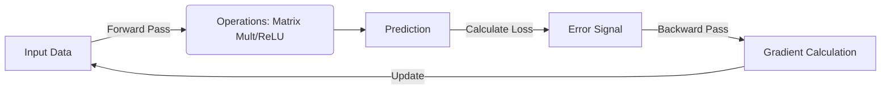

# Cognitive Architect's Handbook: PyTorch Fundamentals

## 1. Concept: The Computational Graph
In PyTorch, a model creates an invisible "map" of operations as it runs (The Forward Pass). This map, or **Computational Graph**, is what allows the computer to understand the path it has to backtrack if required.

* **Backpropagation**: The process of tracing the path backward from the output error to the inputs to calculate how much each component contributed to the error.

### Visualizing the Flow


## 2. Concept: Gradient Descent
Once the error is calculated via backpropagation, the model uses this information to adjust its inputs (weights). By shifting the weights based on their contribution to the error, we minimize the error for the next pass.

* **Analogy**: Think of "Gradient Descent" as sliding down a hill towards the lowest point (the minimum error).

## 3. The "Engineer's" Training Loop
This is the standard, optimized pattern for training models in PyTorch.

```python
import torch

# 1. Setup
# Assume 'model', 'data_loader', 'loss_function', and 'optimizer' are initialized.
model.train() # Set mode to training

# 2. The Training Loop
for epoch in range(num_epochs):
    for batch_data, batch_target in data_loader:
        
        # A. Empty the trash (Reset Gradients)
        # If not done, gradients from previous steps accumulate and corrupt the update.
        optimizer.zero_grad() 
        
        # B. Forward Pass
        predictions = model(batch_data)
        loss = loss_function(predictions, batch_target)
        
        # C. Backward Pass (Calculate Gradients)
        loss.backward()
        
        # D. Weight Update
        optimizer.step()    

```
## 4. The Feynman Gatekeeper: optimizer.zero_grad()

* **Analogy:** Imagine a trash bin in your house. Every iteration (or batch) generates "trash" (gradients). If you don't empty the bin at the start of every cycle, the trash accumulates, rots, and creates a foul smell that ruins the environment (the model's update).
* **Conclusion:** `optimizer.zero_grad()` is the act of emptying the trash bin before starting the next cleaning cycle.

### The Anti-Pattern (Gradient Accumulation)
If you forget `optimizer.zero_grad()`, PyTorch implicitly adds the new gradients to the old ones (`grad = grad + new_grad`). This is useful for large batch accumulation but a fatal bug if done unintentionally. 

```python
# ERROR: Missing optimizer.zero_grad()
for epoch in range(100):
    predictions = model(data)
    loss = loss_function(predictions, target)
    loss.backward() # Gradients accumulate infinitely!
    optimizer.step() # Weights update in the wrong direction over time
```
*(See `broken_example_gradient_accumulation.py` and the corrected `zerograd_fix.py` for full context).*

## Priority Roadmap: What’s Next?

1.  **Batch Processing (Priority: High):** Moving from single data points to batches for GPU efficiency. Tensor shapes will shift from `(H, W, C)` to `(Batch, H, W, C)`.
2.  **Activation Functions (Priority: Medium):** Introducing non-linearity (e.g., ReLU) to learn complex patterns.
3.  **Adding Bias (Priority: Medium):** Allowing the model to shift its linear equations by including a bias vector (`W · x + b`).


