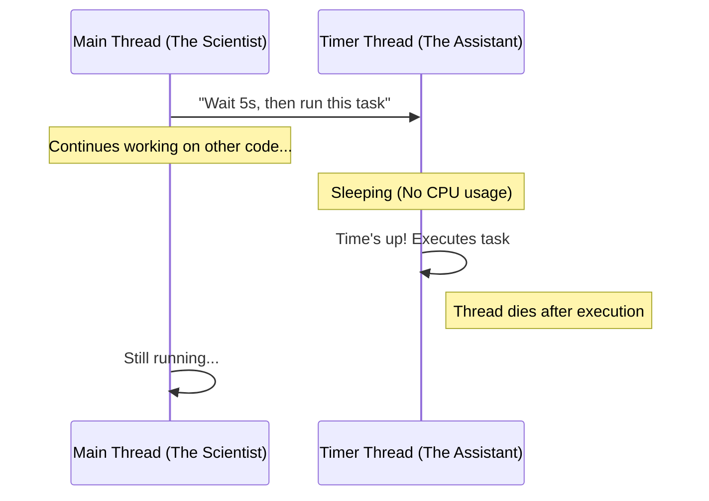

# Python Threading Fundamentals

This directory contains examples detailing how threading in Python works, particularly focusing on background tasks, timers, and gracefully stopping threads. It is part of the digital garden to document my learning curve for advanced Python topics.

## 🧵 The Mental Model

When you use `threading.Timer`, you are creating a "background assistant" that waits for a certain amount of time, executes a function, and then exits. 

*(This diagram is also available in `threading.mmd`)*

## 📂 Scripts Overview

### 1. The Blockers vs. Non-Blockers
- **`execution_block.py`**: Demonstrates how `time.sleep()` halts the main thread entirely.
- **`cooldown_example.py`**: Demonstrates the use of `threading.Timer` to create a cool-down timer for an API fetch without blocking the main code execution.
- **`nonblocker_autosave_example.py`**: Another background timer example demonstrating non-blocking intervals.

### 2. The Nuances of Canceling Timers
- **`broken_cancel_example.py`**: A very common pitfall! It highlights that `t.cancel()` only stops a timer **before** it fires. If the timer has already triggered the target function, `t.cancel()` will no longer have any effect, and the loop inside the thread will continue relentlessly.
- **`broken_example.py` & `broken_example_edgecase.py`**: Showcases further scenarios where background threads do not behave as initially expected if not canceled correctly.

### 3. Graceful Thread Shutdown `threading.Event()`
If a background thread has already started executing a long-running loop or pipeline, you cannot simply "kill" it from the outside in Python. Instead, you need a shared signal.
- **`loop_execution_fix.py`**: Uses `threading.Event` as a stop signal. The thread regularly "checks in" to see if the event has been set, and `break`s the loop if it has.
- **`multievent_execution_stop.py`**: A more complex pipeline where `event.is_set()` is checked between distinct steps allowing for graceful termination mid-pipeline.
- **`broken_example_killswitch_fix.py`**: Fixes the broken examples using the same `threading.Event` approach to act as a killswitch.

## 💡 Key Takeaway
Python threads are great for I/O bounds and timers. However, threads cannot be abruptly 'killed' from the outside. You must always design long-running threading workflows to check for a termination signal (like `threading.Event`) so they can exit themselves gracefully.
